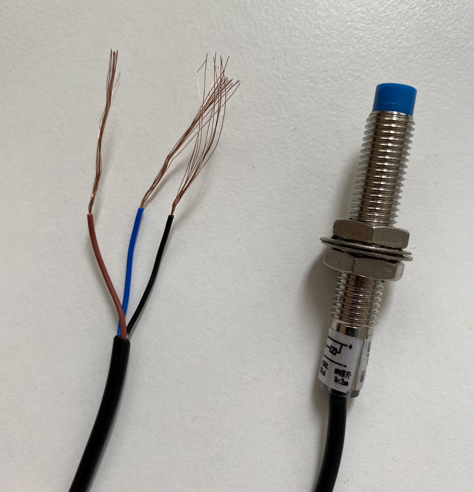
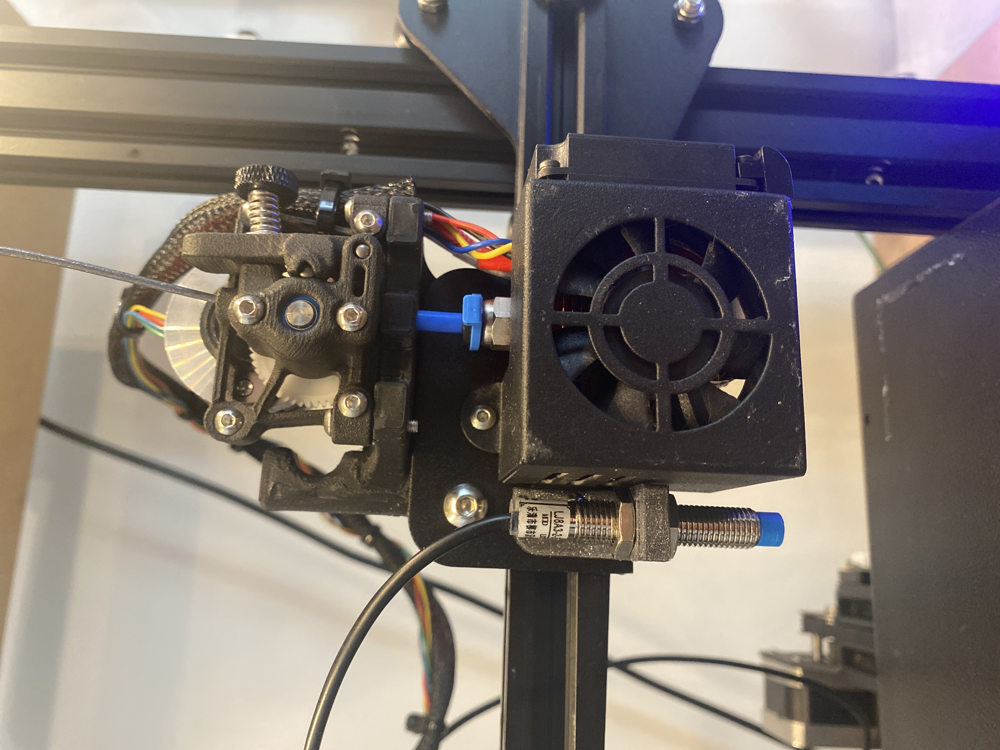

# DIY Inductive sensor ABL
Stupid cheap DIY inductive sensor for auto bed leveling of a 3D Printer.

Reference used while writing these instructions: 
https://www.youtube.com/watch?v=9i5hAhS4QB8

Big thanks to Edward Braiman and his video for guiding me to the right direction !

My version is for my Ender 3 Pro with the SKR V1.4 Turbo mainboard, using a similar but not identical sensor. The wiring seems to be the same though.

This sensor works really well with a spring steel buildplate, I've yet to try with other materials.

This guide assumes you have basic knowledge about compiling Marlin and modifying it, as well as accessing a GCode terminal. If you don't, there are far better teachers than me on YouTube for learning it.

# Making it

Sensor I used with my setup:  
https://www.aliexpress.com/item/1005001622205353.html  
It's a 5v inductive NPN sensor, in an M8-sized housing making it pretty compact but accurate enough.

You need to print out the bracket for the sensor. The 3D Model is in the STL folder. 
Print settings should be tuned for strength, so 3-4 walls and 10%+ infill and .14mm-.2mm layer height.

## Wiring & Installation

I shouldn't have to say this, but POWER DOWN YOUR PRINTER BEFORE DOING THIS !

Disconnect the Z-endstop switch from the mainboard.


Brown = +5V  
Blue = GND  
Black = Signal

Connect these three wires to their corresponding pins in this diagram, so that our sensor replaces the Z-endstop switch:


Mount the 3D-printed bracket (That you _did_ print before disassembling your printer right ???) with stock hardware as shown in the image:



## Firmware

Download the latest marlin, copy-paste your example configs of your printer in there and open up your favorite text editor.

Make these changes to configuration.h:

``` #define Z_MIN_ENDSTOP_INVERTING true  ```  
``` #define Z_MIN_PROBE_ENDSTOP_INVERTING true ```  

Make sure these are uncommented:  
``` #define FIX_MOUNTED_PROBE  ```  
``` #define Z_MIN_PROBE_USES_Z_MIN_ENDSTOP_PIN  ```  
``` #define Z_SAFE_HOMING  ```  
(The reference video states otherwise, however I found out that by uncommenting these it will work as intended)

If you're using the same setup as me, you can add these as probe offsets (these might not be 100% accurate, but good enough):

``` #define NOZZLE_TO_PROBE_OFFSET { -45, -8, 0 } ```  

Remember to also enable your preferred auto bed leveling features !

After configuring other configs regarding your setup, compile and flash your board !
## Testing

Once you've flashed your board, move the X-gantry up and put something metallic under the sensor, it should flash a red LED, indicating that the probe is activated. If not, check wiring.

Now whip up your favorite GCode terminal and connect to your printer.  
Send ``` M119 ``` without anything under the sensor and check that all endstops are in ``` "open" ``` state.  
Place something metallic under it, so that the led lights up. Now send ```M119``` again, and Z-min endstop should be ``` TRIGGERED ```.
If everything works as intended, you can try homing the Z-axis.
